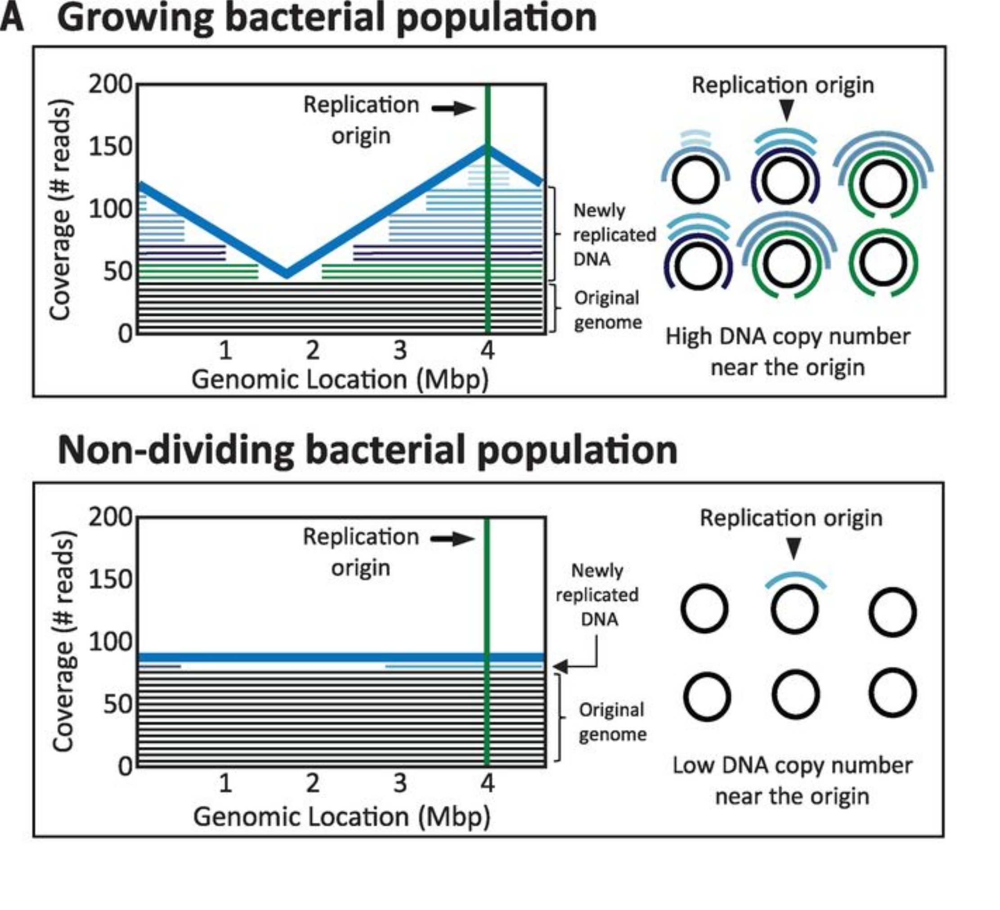
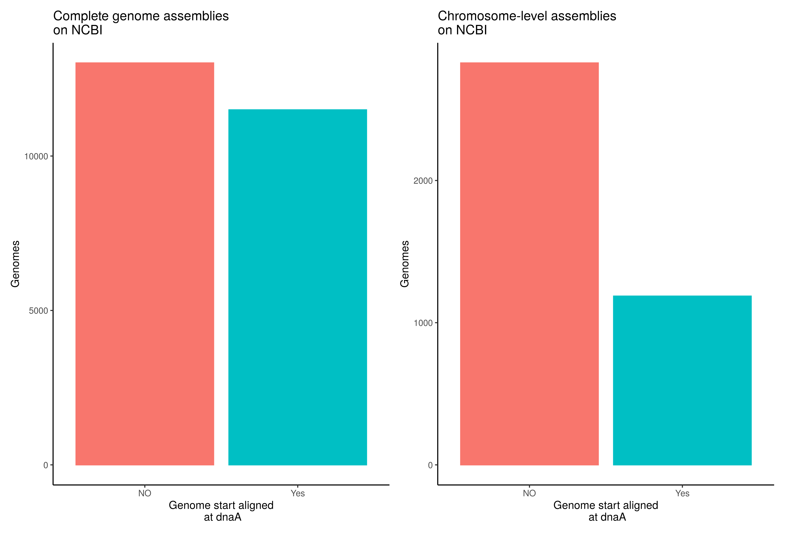

# Circles

Circles is a tool to check the circularity of bacterial genome assemblies and circularise them according to the location of origin of replication.

In brief, it detects the presence of the origin of replication (i.e. *dnaA*). Moreover it checks the ciruclarity of contigs bying looking for overlap at the contig edges and mapping the raw data to identify overlaping reads. Based on this information it circularises and start aligns the bacterial contigs upstream of *dnaA* gene.

Circles was designed and implemented by Vincent Somerville and Michael Schmid as a free software under the GPLv3 license.

# Table of contents

* [Idea](#idea)
* [Requirements](#requirements)
* [Installation](#installation)
    * [Build and run without installation](#build-and-run-without-installation)
* [Usage examples](#usage-examples)
* [Output of a Circleries run](#output-of-a-Circleries-run)
* [Full usage](#full-usage)
* [How it works](#how-it-works)
* [Known limitations](#known-limitations)
* [License](#license)

# Idea

*Sensu stricto* circular genomes do not have a start and end. However bacterial chromosomes have a single, unique origin of replication (oriC). DNA replication starts at the first position of the replication initiator protein, also called *dnaA*. This results in a skewed read coverage distribution when sequencing growing bacteria. They generally show higher coverages at the origin of replication (i.e. *dnaA*) then at the terminus (Fig. 1).

<p align = "center">

</p>
<p align = "center">
Fig.1 - Peak-to-trough ratio (PTR) for a growing or non-growing bacteria. Taken from Korem et al. 2015 (DOI: 10.1126/science.aac4812)
</p>

In order to compare genomes with each other, it has been decided to start align assembled genomes at the beginning of the *dnaA* gene, which should be located on the positive strand (REF). Previous tools, e.g. circlator (REF) attempt to identify completely assembled genomes and start align them. However it is limited in it's utility of using different sequencing methods and the high throughput of many sequencing projects today. Very few genome assembly tools incorporate start alignment into the workflow. Most notably Unicycler (REF) and Tricylcler (REF) identifies circular, bacterial contigs and start aligns them accordingly. Nevertheless the large majority of genomes on NCBI remain not start aligned (Fig. 2). This hinders a streamlined comparative genomic approach, e.g. genome synteny cannot easily be inferred.


<p align = "center">

</p>
<p align = "center">
Fig.2 -Number of start aligned and non-start aligned genomes on NCBI assgined to chromosome level assemblies (done on 30.12.2021))
</p>


Here, we are creating a pipeline that checks the circularity of genome assemblies and circularises them according to the location of the dnaA.

Aims:

1. Create a tool that identifies and circularises complete bacterial contigs
2. Create a fast and scalable approach
3. Use as few dependencies as possible


# Requirements


* Linux
* [bedtools](https://bedtools.readthedocs.io/en/latest/index.html)
* [Minimap2](https://github.com/lh3/minimap2)


Circles is currently not tested on macOS or Windows.

#  Installation

### Build and run without installation

By simply running `make` in CircAidMe's directory, you can compile the C++ components but not install an executable. The program can then be executed by directly calling the `circaidme-runner.py` script.

```bash
git clone https://github.com/Freevini/Circleries.git
cd Circleries

Circleries.sh -h
```


# Usage examples

__Minimally parameterized run of Circleries:__<br>
`Circleries.sh -i input_assembly.fasta -l input_long reads `

__If you want to run it in multithread mode use flag `-t`:__<br>
`Circleries.sh -i input_assembly.fasta -l input_long reads -t 8 `

__If you want to overwrite the previous run use flag `-F`:__<br>
`Circleries.sh -i input_assembly.fasta -l input_long reads -F `

__If you want to keep all tmp files use flag `-x`:__<br>
`Circleries.sh -i input_assembly.fasta -l input_long reads -x `

__If you want to define a specific output file name use `-o` or output file directory use `-d` :__<br>
`Circleries.sh -i input_assembly.fasta -l input_long reads -o results -d results/out/directory/ `

# Output of a Circleries run

Circleries outputs two files:
* *basename*.fasta: Contains the newly startaligned fasta file. All contigs that were startaligned are labelled with a *_startaligned* in the fasta header.
* *basename*_analysis_circularity_extended.log: Contains statisticis for all contigs and if they were startaligned.


# Full usage

```
usage: Circleries.sh [-h] -i INPUT_GENOME -l LONG_READ_FILE [-f SHORT_READ_FORWARD]
                     [-r SHORT_READ_REVERSE] [-d  OUTPUT_DIRECTORY] [-O OUTPUT_FILE]
                     [-p CIRCLERIES_SCRIPT_DIRECTORY] [-t THREADS] [-x] [-F] [-v] [-V]

Circleries: checks the circularity and bacterial origins of contigs and
startaligns them at dnaA if possible

minimal syntax: Circleries -i <genome_input.fasta> -l <raw_long_read.fastq.gz>
                 options:

                 INPUT
                    -i     input genome name (in fasta format) (MANDATORY)
                    -l     long read file (fq or fq.gz) (MANDATORY)
                    -f     short read forward read (read 1) (fq or fq.gz)
                    -r     short read reverse read (read 2) (fq or fq.gz)

                 OUTPUT
                    -d     output directory [.]
                    -o     output file name

                 RUNNING OPTIONS
                    -p     circleries script directory (with all dependencies) [PATH]
                    -t     number of threads to use [4]
                    -x     keep all tmp files created [N]
                    -F     Force everything to run again [N]

                 INFOS
                    -h     help option
                    -v     verbose [N]
                    -V     print Version [N]

```


# How Circleries works

Test Circleries with the two provided test cases:

1. two circular contigs

`Circleries.sh -i 03_test_Data/twoCircularContigs_SRR3880379.fasta -l 03_test_Data/twoCircularContigs_SRR3880379.fastq.gz `

2. one circular and eigth non-circular contigs

`Circleries.sh -i 03_test_Data/oneCircular_eigthNonCircular_SRR15376163.fasta -l 03_test_Data/oneCircular_eigthNonCircular_SRR15376163.fastq.gz `


# Known limitations
* Circleries does not polish contigs after start aligning. Might be addressed later if needed.
* Circleries does not circleries non-bacterial contigs. It reports them but does not change the location. Might be addressed later if needed.
* Circleries does not start align or arrange incomplete bacterial assemblies. Might be addressed later if needed.


# License

[GNU General Public License, version 3](https://www.gnu.org/licenses/gpl-3.0.html)
