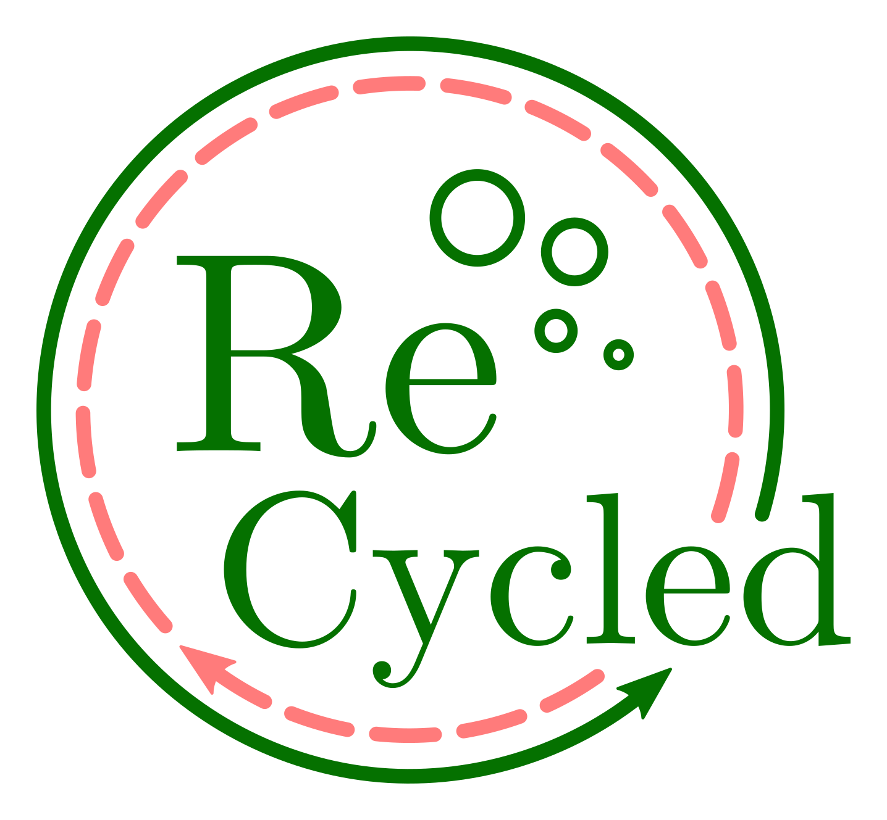

<p align = "left">

</p>

**ReCycled** is a tool to check the circularity of bacterial genome assemblies and circularise them according to the location of the replication initiation protein *dnaA*.

In brief, it detects the presence of the origin of replication (i.e. *dnaA*). Moreover it checks the circularity of contigs by looking for overlap at the contig edges and mapping the raw data to identify overlapping reads. Based on this information it circularises and restarts the bacterial chromsomes and plasmid contigs upstream of *dnaA* gene.

ReCycled was designed and implemented by Vincent Somerville, Michael Schmid and Philipp Engel as a freely available software under the GPLv3 license.

<p align = "left">

</p>

# Table of contents

* [Requirements](#requirements)
* [Installation](#installation)
* [Usage examples](#usage-examples)
* [Output of a ReCycled run](#output-of-a-ReCycled-run)
* [Full usage](#full-usage)
* [ How ReCycled works](#How-ReCycled-works)
* [Known limitations](#known-limitations)
* [License](#license)


# Requirements


* Linux
* [bedtools](https://bedtools.readthedocs.io/en/latest/index.html)
* [Minimap2](https://github.com/lh3/minimap2)


ReCycled currently does not support macOS and Windows.

#  Installation

```bash
git clone https://github.com/Freevini/ReCycled.git
cd ReCycled

./ReCycled.sh -h
```

In addition you have to install Minimap2 and bedtools. Make sure that bash will find them either via adding to PATH variable or installation into a system folder.


# Usage examples

__Minimally parameterized run of Circleries:__<br>
`ReCycled.sh -i input_assembly.fasta -l input_long_reads `

__If you want to run it in multithread mode use flag `-t`:__<br>
`ReCycled.sh -i input_assembly.fasta -l input_long_reads -t 8 `

__If you want to overwrite the previous run use flag `-F`:__<br>
`ReCycled.sh -i input_assembly.fasta -l input_long_reads -F `

__If you want to keep all tmp files use flag `-x`:__<br>
`ReCycled.sh -i input_assembly.fasta -l input_long_reads -x `

__If you want to define a specific output file name use `-o` or output file directory use `-d` :__<br>
`ReCycled.sh -i input_assembly.fasta -l input_long_reads -o results -d results/out/directory/ `

# Output of a ReCycled run

ReCycled outputs two files:
* *basename*.fasta: Contains the newly restarted fasta file. All contigs that were restarted are labelled with a *_restart* in the fasta header.
* *basename*_analysis_circularity_extended.log: Contains statisticis for all contigs and if they were restarted.


# Full usage

```
usage: ReCycled.sh [-h] -i INPUT_GENOME -l LONG_READ_FILE [-f SHORT_READ_FORWARD]
                     [-r SHORT_READ_REVERSE] [-d  OUTPUT_DIRECTORY] [-O OUTPUT_FILE]
                     [-p ReCycled_SCRIPT_DIRECTORY] [-t THREADS] [-x] [-F] [-v] [-V]

ReCycled: checks the circularity and bacterial origins of contigs and
restarts them at dnaA if possible

minimal syntax: ReCycled.sh -i <genome_input.fasta> -l <raw_long_read.fastq.gz>
                 options:

                 INPUT
                    -i     input genome name (in fasta format) (MANDATORY)
                    -l     long read file (fq or fq.gz) (MANDATORY)
                    -f     short read forward read (read 1) (fq or fq.gz)
                    -r     short read reverse read (read 2) (fq or fq.gz)

                 OUTPUT
                    -d     output directory [.]
                    -o     output file name

                 RUNNING OPTIONS
                    -p     ReCycled script directory (with all dependencies) [PATH]
                    -t     number of threads to use [4]
                    -x     keep all tmp files created [N]
                    -F     Force everything to run again [N]

                 INFOS
                    -h     help option
                    -v     verbose [N]
                    -V     print Version [N]

```


# How ReCycled works

Test ReCycled with the two provided test data sets:

1. two circular contigs

`ReCycled.sh -i 03_test_Data/twoCircularContigs_SRR3880379.fasta -l 03_test_Data/twoCircularContigs_SRR3880379.fastq.gz `

2. one circular and eight non-circular contigs

`ReCycled.sh -i 03_test_Data/oneCircular_eigthNonCircular_SRR15376163.fasta -l 03_test_Data/oneCircular_eigthNonCircular_SRR15376163.fastq.gz `


# Known limitations
* ReCycled does not polish contigs after start aligning. Might be addressed later if needed.
* ReCycled does not circularies non-bacterial contigs. It reports them but does not change the location. Might be addressed later if needed.
* ReCycled does not restart or arrange incomplete bacterial assemblies. Might be addressed later if needed.


# License

[GNU General Public License, version 3](https://www.gnu.org/licenses/gpl-3.0.html)
