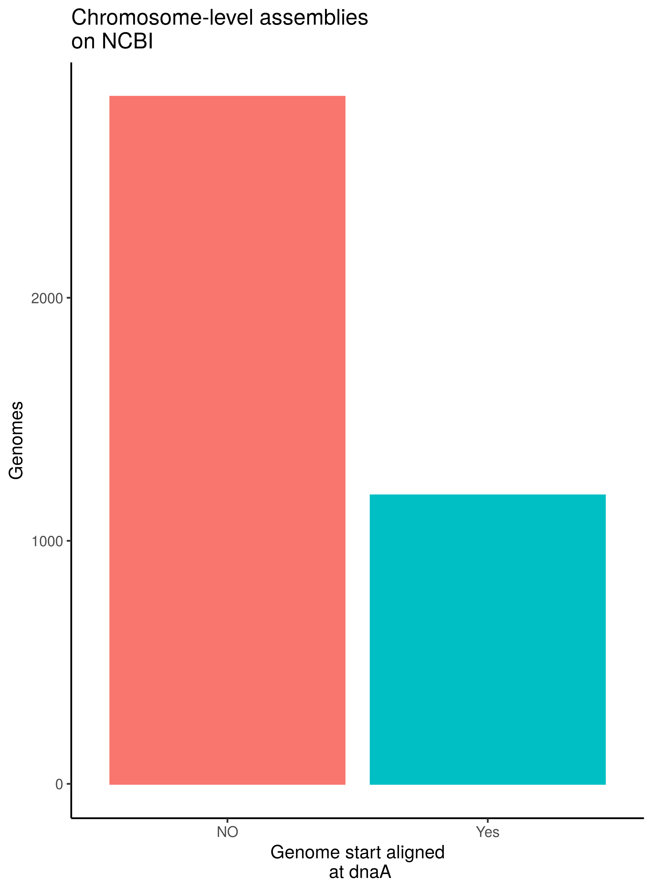

# Circles
Michael Schmid & Vincent Somerville

*Sensu stricto* circular genomes do not have a start and end. However genome replication starts at the first position of the the replication origin gene, also called dnaA. This results in a skewed read coverage distribution when sequencing bacteria in the log phase. They generally show higher coverages at the origin of replication (i.e. dnaA) then at the terminus (Fig. 1).

Fig.1 - Peak-to-trough ratio (PTR) for a growing or non-growing bacteria. Taken from Korem et al. 2015 (DOI: 10.1126/science.aac4812)

In order to compare genomes with each other it has been decided to start align completly assembled genomes infront of the dnaA gene on the positive strand (REF). Previous tools, e.g. circlator (REF) try to identify completly assembled genomes and start align them, however it often does not work and cannot cope with the high throughput of many projects. Very few genome assembly tools actually incorporate start alignement into the workflow. Most noteably Unicycler (REF) and Tricylcler identifies circulor, bacterial contigs and start aligns them accordingly. Nevertheless the large majority of genomes on NCBI remain not start aligned (Fig. 2). This hinders a good comparative genomic approach, e.g.genome synteny cannot easyly be infered.

Fig.2 -Number of start aligned and non-start aligned genomes on NCBI assgined to chromosome level assemblies (done on 30.12.2021))

Here, we are creating a pipeline that checks the circularity of genome assemblies and circluarises them according to the location of the dnaA.

In order to to this we are working on the following parts:

## 1. check query genome assembly

- check contigs: how many? How large?
- try to identify contig origines (bacteria, plasmids, phages)
- identify  if only 1 bacterial contigs

  ==> Take home: contig originates from?

## 2. check circularity

- map ends (10kb) onto eachother (minimap2) --> overlap or not
- merge contig ends and map raw reads+ look for:
  - even coverage (output: X coverage--> is this in the range)
  - spanning reads (number of reads)
    - PE (are pairs mapping)
    - ONT/Pacbio (is read spanning)

    ==> Take home: contig is circler or not!

## 3. circleries

  - take dnaA diamond mapping (+prodigal)
  - check if no genes are on reverse strand (prodigal)
  - check for presence of DNAa
  - check for DNAa orientation
  - cut and shift fasta start

## 4. Polish the newly stitched region (optional)

  - QC how many locations have change!
  - advise if additional polishing is required!

## 5 put Illumina contigs into synteny

Most genomes however are not finished (complete and circular), therefore it would be good to have an option for these too.

- check dnaA location of the REF sequence
- check dnaA lcoation of the query sequence
- minimap2 query sequence to REF sequence
- split first contigs at dnaA (+)
- arrange contigs according to minimap2 alignment
- (optional: change headers)

## 6. check contaminations

- PhiX
- humman contaminations
